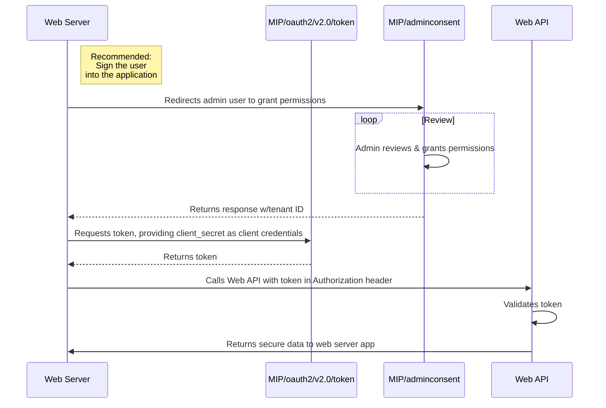

# Microsoft identity platform and the OAuth 2.0 client credentials flow

You can use the OAuth 2.0 client credentials grant specified in RFC 6749, sometimes called *two-legged OAuth*, to access web-hosted resources by using the **identity** of an **application**. This type of grant is commonly used for **server-to-server** interactions that must run in the background, **without** immediate interaction with a **user**. These types of applications are often referred to as daemons or services accounts. 

The OAuth 2.0 client credentials grant flow permits a web service (confidential client) to use its own credentials, instead of impersonating a user, to authenticate when calling another web service. In this scenario, the client is typically a middle-tier web service, a daemon service, or a web site. For a higher level of assurance, the Microsoft identity platform also allows the calling service to use a certificate (instead of a shared secret) as a credentials.

In a more typical *three-legged OAuth*, a client application is granted permission to access a resource on behalf of a specific user. The permission is delegated from the user to the application, usually during the consent process. However, in the client credentials (two-legged OAuth)flow, permissions are granted directly to the application itself. When the app presents a token to a resource, the resource enforces that the app itself has authorization to perform an action and not the user.

# Protocol Diagram

The entire client credentials flow looks similar to the following diagram.

        Microsoft Identity Platform
        https://login.microsoftonline.com/common

# Get direct authorization

An app typically receives direct authorization to access a resource in one of two ways:

- Through an access control list (ACL) at the resource
- Through application permission assignment in Azure AD

These two methods are the most common in Azure AD and we recommend them for clients and resources that perform the client credentials flow. A resource can also choose to authorize its clients in other ways. Each resource server can choose the methods that makes the most sense for its application.

## Access control lists

A resource provider might enforce an authorization check based on a list of application (client) IDs that it knows and grants a specific level of access to. When the resource receives a token from the Microsoft identity platform endpoint, it can decode the token and extract the client's application ID from the `appid` and `iss` claims. Then it compares the application against an access control list (ACL) that it maintains. The ACL's granularity and method might vary substantially between resources.

This type of authorization is common for daemons and service accounts that need to access data owned by consumer users who have personal Microsoft accounts. For data owned by organizations, we recommend that you get the necessary authorization through application permissions.

## Application permissions

Instead of using ACLs, you can use APIs to expose a set of **application permissions**. An application permission is granted to an application by an organization's administrator, and can be used only to access data owned by that organization and its employees. For example, Microsoft Graph exposes several application permissions to do the following:

- Read mail in all mailboxes
- Read and write mail in all mailboxes
- Send mail as any user
- Read directory data

To use application permissions in your app, follow the steps discussed in the next sections.

        Note

        When authenticating as an application, as opposed to with a user, you cannot use "delegated permissions" (scopes that are granted by a user). You must use "application permissions", also known as "roles", that are granted by an admin for the application (or via pre-authorization by the web API).

