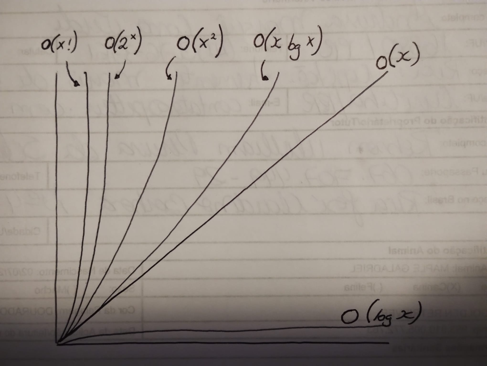
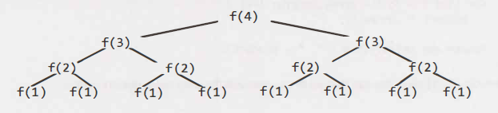

# Big O

This is such an important concept that you should master it!

Big O time is the language and metric we use to describe the efficiency of algorithms. Not understanding it thoroughly can really hurt you in developing an algorithm. You will be judged harshly for not really understanding Big O, but you will also struggle to judge when your algorithm is getting faster or slower.

Master this concept!

## Time Complexity

This is what the concept of asymptotic runtime, or big O time, means.

> Asymptotic complexity is the key to comparing algorithms. Comparing absolute time is not particularly meaningful, because they are specific to particular hardware. Asymptotic complexity reveals deeper mathematical truths about algorithms that are independent of hardware.

We could describe the data transfer algorithm runtime as:

* Electronic Transfer: O(s), where s is the size of the file. This means that the time to transfer the file increases linearly with the size of the file.
* Airplane Transfer: O(1) with respect to the size of the file. As the size of the file increases, it won't take any longer to get the file to your friend. The time is constant.

No matter how big the constant is and how slow the linear increase is, linear will at some point surpass constant.

|
|O(1)     /
|_ _ _ _ /_ _ _ _ _ _ _ _ _
|       /
|      /
|     /
|    /O(s)
|   /
|  /
| /
|/
|___________________________

There are many more runtimes than this. Some of the most common ones are O(log N), O(N log N), O(N), O(N^2) and O(2^N). There's no fixed list of possible runtimes, though.

You can also have multiple variables in your runtime. For example, the time to paint a fence that's W meters wide and h meters high could be described as O(wh). If you needed p layers of paint, then you could say that the time is O(whp).

### Big O, Big Theta, and Big Omega

Academics use big O, big Theta, and big Omega to describe runtimes.

* O (big O): In academia, big O describes an upper bound on the time. An algorithm that prints all the values in an array could be described as O(N), but it could also be described as O(N^2), O(N^3), O(2^N) (or many other big O times). The algorithm is at least as fast as each of these; therefore they are upper bounds on the runtime. This is similar to a less-than-or-equal-to relationship.
* Big Omega: In academia, big omega is the equivalent concept but for lower bound. Printing the values in an array is Big Omega(N) as well as Big Omega(log N) and Big Omega(1). After all, you know that it won't be faster than those runtimes.
* Big Theta: In academia, Big Theta means both Big O and Big Omega. That is, an algorithm is Big Theta(N) if it is both O(N) and Big Omega(N). Bit Theta gives a tight bound on runtime.

In industry (and therefore in interviews), people seem to have merged Big Theta and Big O together. Industry's meaning of Big O is closer to what academics mean by Big Theta, in that it would be seen as incorrect to describe printing an array as O(N^2). Industry would just say this is O(N).

Let's try to think of Big O in the way that industry tends to use it: by always trying to offer the tightest description of the runtime.

### Best Case, Worst Case, and Expected Case

We can describe our runtime for an algorithm in three different ways. Let's look at this from the perspective of quick sort. Quick soft picks a random element as a "pivot" and then swaps values in the array such that the elements less than the pivot appear before elements greater than pivot. This gives a "partial sort". Then it recursively sorts the left and right sides using a similar process.

* **Best Case:** If all elements are equal, then quick sort will, on average, just traverse through the array once. This is O(N). (This actually depends slightly on the implementation of quick sort. There are implementations, though, that will run very quickly on a sorted array.)
* **Worst Case:** What if we get really unlucky and the pivot is repeatedly the biggest element in the array? (Actually, this can easily happen. If the pivot is chosen to be the first element in the subarray and the array is sorted in reverse order, we'll have this situation.) In this case, our recursion doesn't divide the array in half and recurse on each half. It just shrinks the subarray by one element. This will degenerate to an O(N^2) runtime.
* **Expected Case:** Usually, though, these wonderful or terrible situations won't happen. Sure, sometimes the pivot will be very low or very high, but it won't happen over and over again. We can expect a runtime of O(N log N).

We rarely ever discuss best case time complexity, because it's not a very useful concept. After all, we could take essentially any algorithm, special case some input, and then get an O(1) time in the best case.

For many - probably most - algorithms, the worst case and the expected case are the same. Sometimes they're different, though, and we need to describe both of the runtimes.

What is the relationship between best/worst/expected case and big O/theta/omega?

It's easy to muddle these concepts. There is no particular relationship between the concepts.

Best, worst, and expected cases describe the big O (or big theta) time for particular inputs or scenarios.

Big O, big omega, and big theta describe the upper, lower, and tight bounds for the runtime.

## Space Complexity

Time is not the only thing that matters in an algorithm. We might also care about the amount of memory - or space - required by an algorithm.

Space complexity is a parallel concept to time complexity. If we need to crate an array of size n, this will require O(n) space. If we need a two-dimensional array of size nxn, this will require O(n^2) space.

Stack space in recursive calls counts too. For example, code like this would take O(n) time and O(n) space.

```c
int sum(int n) { /* Ex 1.*/
	if (n <= 0) {
		return 0;
	}
	return n + sum(n-1);
}
```

Each call adds a level to the stack:

```c
sum(4)
	-> sum(3)
		-> sum(2)
			-> sum(1)
				-> sum(0)
```

Each of these calls is added to the call stack and takes up actual memory.

However, just because you have n calls total doesn't mean it takes O(n) space. Consider the below function, which adds adjacent elements between 0 and n:

```c
int pairSumSequence(int n) {
	int sum = 0;
	for (int i = 0; i < n; i++;) {
		sum += pairSum(i, i + 1);
	}
	return sum;
}

int pairSum(int a, int b) {
	return a + b;
}
```

There will be roughly O(n) calls to pairSum. However, those calls do not exist simultaneously on the call stack, so you only need O(1) space.

### Drop the Constants

It is very possible for O(N) code to run faster than O(1) code for specific inputs. Big O just describes the rate of increase.

For this reason, we drop the constants in runtime. An algorithm that one might have described as O(2N) is actually O(N).

Many people resist doing this. They will see code that has two (non-nested) for loops and continue this O(2N). They think they are being more "precise". They are not.

Constants in runtime really do not matter in time and space complexity.

Big O allows us to express how the runtime scales. We just need to accepts that it doesn't mean that O(N) is always better than O(N^2).

### Drop the Non-Dominant Terms

What do you do about an expression such as O(N^2 + N)? That second N isn't exactly a constant. But it's not especially important.

You should drop the non-dominant terms.

* O(N^2 + N) becomes O(N^2)
* O(N + log N) becoms O(N)
* O(5*2^n + 1000N^100) becomes O(2^N)

We might still have a sum in a runtime. For example, the expression O(B^2 + A) cannot be reduced (without some special knowledge of A and B).

The following graph depicts the rate of increase for some of the common big O times.



As you can see, O(X^2) is much worse than O(x), but it's not nearly as bad as O(2^x) or O(x!). There are lots of runtimes worse then O(x!) too, such as O(x^x) or O(2^x * x!).

### Multi-Part Algorithms: Add vs. Multiply

Suppose you have an algorithm that has two steps. When do you multiply the runtimes and when do you add them?

This is a common source of confusion for candidates.

**Add the runtimes: O(A + B)**

```lang
for (int a : arrA) {
	print(a);
}

for (int b : arrB) {
	print(b);
}
```

**Multiply the Runtimes: O(A * B)**

```lang
for (int a : arrA) {
	for (int b : arrB) {
		print(a + "," + b);
	}
}
```

In the first example, we do A chunks of work then B chunks of work. Therefore, the total amount of work is O(A + B).

In the second example, we do B chunks of work for each element in A. Therefore, the total amount of work is O(A * B).

In other words:

* If your algorithm is in the form "do this, then, when you're all done, do that" then you add the runtimes.
* If your algorithm is in the form "do this for each time you do that" then you multiply the runtimes.

### Amortized Time

An ArrayList, or a dynamically resizing array, allows you to have the benefits of an array while offering flexibility in size. You won't run out of space in the ArrayList since its capacity grow as you insert elements.

An ArrayList is implemented with an array. When the array hits capacity, the ArrayList class will create a new array with double the capacity and copy all the elements over to the new array.

How do you describe the runtime of insertion? This is a tricky question.

The array could be full. If the array contains N elements, then inserting a new element will take O(N) time. You will have to crate a new array of size 2N and then copy N elements over. This insertion will take O(N) time.

However, we also know that this doesn't happen very often. The vast majority of the time insertion will be in O(1) time.

We need a concept that takes both into account. This is what amortized time does. It allows us to describe that, yes, this worst case happens every once in a while. But once it happens, it won't happen again for so long that the cost is "amortized."

In this case, what is the amortized time?

As we insert elements, we double the capacity when the size of the array is a power of 2. So after X elements, we double the capacity at array sizes 1, 2, 4, 8, 16, ..., X. That doubling takes, respectively, 1, 2, 4, 8, 16, 32, 64, ..., X copies.

What is the sum of 1 + 2 + 4 + 8 + 16 + ... + X? If you read this left to right, it starts with 1 and doubles until gets to X. If you read right to left, it starts with X and halves until it gets to 1.

What then is the sum of X + x/2 + x/4 + x/8 + ... 1? This is roughly 2X.

Therefore, X insertions take O(2X) time. The amortized time for each insertion is O(1).

### Log N Runtimes

We commonly see O(log N) in runtimes. Where does this come from?

Let's look at binary search as an example. In binary search, we are looking for an example X in an N-element sorted array. We first compare X to the midpoint of the array. If x == middle, the we return. If x < middle, then we search on the left side of the array. If x > middle, then we search on the right side of the array.

We start off with an N-element array to search. Then, after a single step, we're down to N/2 elements. One more step and we're down to N/4 elements. We stop when we either find the value or we're down to just one element.

The total runtime is then a matter of how many steps (dividing N by 2 each time) we can take until N becomes 1.

N = 16
N = 8	/*divide by 2*/
N = 4	/*divide by 2*/
N = 2	/*divide by 2*/
N = 1	/*divide by 2*/

We could look at this in reverse (going from 1 to 16 instead of 16 to 1). How many times we can multiply 1 by 2 until we get N?

N = 1
N = 2 	/*multiply by 2*/
N = 4	/*multiply by 2*/
N = 8	/*multiply by 2*/
N = 16	/*multiply by 2*/

What is k in the expression 2^k = N? This is exactly what log expresses.

2^4 = 16 -> log2 16 = 4
log2 N = k -> 2^k = N

This is a good takeaway for you to have. When you see a problem where the number of elements in the problem space gets halved each time, that will likely be a O(log N) runtime.

This is the same reason why finding an element in a balanced binary is O(log N). With each comparison, we go either left or right. Half the nodes are on each side, so we cut the problem space in half each time.

### Recursive Runtimes

Here's a tricky one. What's the runtime of this code?

```c
int f(int n) {
	if (n <= 1) {
		return 1;
	}
	return f(n - 1) + f(n -1);
}
```

Suppose we call f(4). This calls f(3) twice. Each of those calls to f(3) calls f(2), until we get to f(1).



The tree will have depth N. Each node (i.e., function call) has two children. Therefore, each level will have twice as many calls as he one above it. The number of nodes on each level is:

|Level|#Nodes|Also expressed as...|Or...|
|:---:|:----:|:------------------:|:---:|
|0    |1     |                    |2^0  |
|1    |2     |2 * previous level = 2|2^1|
|2    |4     |2 * previous level = 2 * 2^1 = 2^2|2^2|
|3    |8     |2 * previous level = 2 * 2^2 = 2^3|2^3|
|4    |16    |2 * previous level = 2 * 2^3 = 2^4|2^4|

Therefore, there will be 2^0 + 2^1 + 2^2 + 2^3 + 2^4 + ... + 2^N (which is 2^n+1 - 1) nodes.

It is two to the power of N+1 because you count the first N^0 which is 1. So in the example above, it