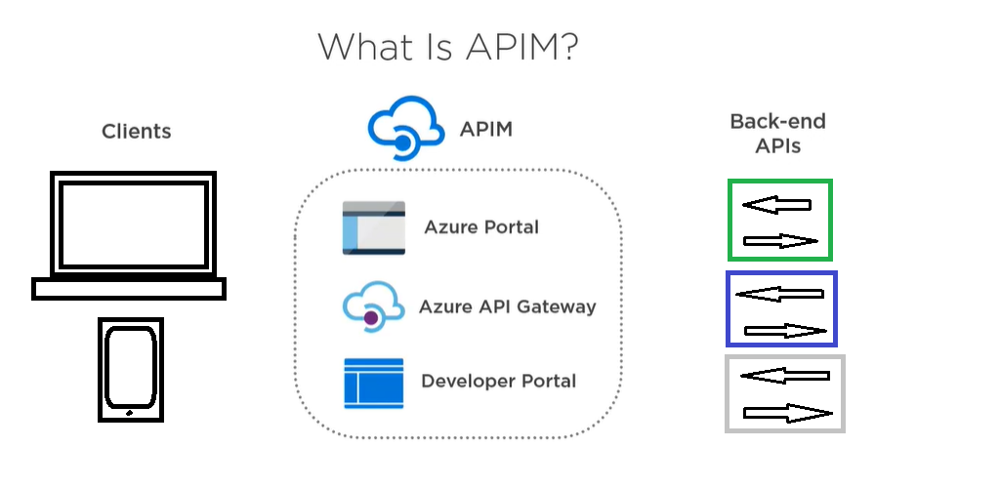

# Recommending a Hosting Structure for API Management

## Why APIs?

APIs help to make your applications more modular, following a Service Oriented approach.

APIs allow service-oriented design. This leads to easier integration and easier maintenance.

## APIM

Azure API Management (APIM) helps organizations to publish existing back-end APIs for external consumers, partners, and internal developers.

API sits between clients and back-end APIs:

## Why?

* Easy API consumption for clients and internal developers
* Enable API versioning and revisioning
* Easy integration with AAD for B2B and B2C federated authentication
* Usage report, monitoring
* Define quotas for callers, throttling
* Provides API documentation, mocking, IP filtering, and response caching

## APIM Components

* API Gateway
  * The endpoint that accepts the API calls from clients
* Azure Portal
  * The admin interface where the API Management is set up
* Developer Portal
  * The web panel for the developers who intend to consume the APIs 

