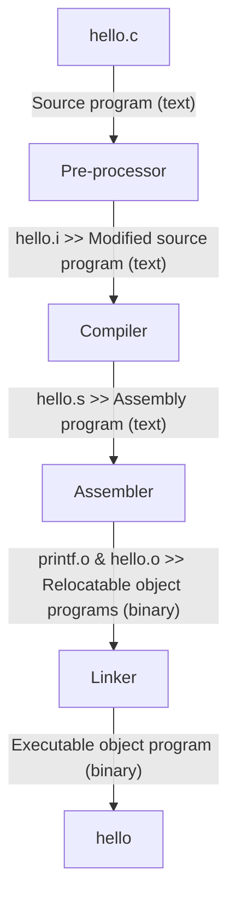

# A Tour of Computer Systems

A computer systems consists of hardware and systems software that work together
to run application programs. Specific implementations of systems change over
time, but the underlying concepts do not.

You need to dedicate yourself to learn the concepts in this book.

This is the ASCII text representation of hello.c:

```text
# i n c l u d e SP < s t d i o .
35 105 110 99 108 117 100 101 32 60 115 116 100 105 111 46
h > \n \n i n t SP m a i n ( ) \n {
104 62 10 10 105 110 116 32 109 97 105 110 40 41 10 123
\n SP SP SP SP p r i n t f ( " h e l
10 32 32 32 32 112 114 105 110 116 102 40 34 104 101 108
l o , SP w o r l d \ n " ) ; \n SP
108 111 44 32 119 111 114 108 100 92 110 34 41 59 10 32
SP SP SP r e t u r n SP 0 ; \n } \n
32 32 32 114 101 116 117 114 110 32 48 59 10 125 10
```

## 1.1 Information Is Bits + Context

The hello program begins life as a source program (or source file) that the
programmer creates with an editor and saves in a text file called `hello.c`. The
source program is a sequence of bits, each with a value of 0 or 1, organized in
8-bit chunks called bytes. Each byte represents some text character in the
program.

ASCII standard represents each character with a unique byte-size integer value.

The `hello.c` program is stored in a file as a sequence of bytes. What is a
byte? It's a group of 8 bits. What is a bit? It's the smallest unit of
information in a computer, it's either 0 or 1. So a sequence of bytes would be
something like this:

```text
01001111 10001001 111101010 11000000
```

And in the `hello.c` program stored in a file as a sequence of bytes, each byte
has an integer value that corresponds to some character. For example, the
character `r` in ASCII is represented by the integer `114`. Files such as
`hello.c` that consist exclusively of ASCII characters are known as text files.
All other files are known as binary files.

The representation of `hello.c` illustrates a fundamental ideaL All information
in a system - including disk files, programs stored in memory, user data stored
in memory, and data transferred across a network - is represented as a bunch of
bits. The only thing that distinguishes different data objects is the context in
which we view them. For example, in different contexts, the same sequence of
bytes might represent an integer, floating-point number, character string, or
machine instruction.

As programmers we need to understand machine representations of numbers because
they are not the same as integers and real numbers. They are finite
approximations that can behave in unexpected ways.

## Programs are Translated by Other Programs into Different Forms

The hello program begins life as a high-level C program because it can be read
and understood by human beings in that form. However, in order to run hello.c on
the system, the individual C statements must be translated by other programs
into a sequence of low-level machine-language instructions. These instructions
are then packaged in a form called an executable object program and stored as a
binary disk file. Object programs are also referred to as executable object
files.

On a Unix system, the translation from source file to object file is performed
by a compiler driver:



```bash
gcc -o hello hello.c
```

Here, the GCC compiler driver reads the source file `hello.c` and translates it
into an executable object file `hello`. The translation is performed in the
sequence of four phases. The programs that perform the four phases
(preprocessor, compiler, assembler, and linker) are known collectively as the
compilation system.

* Preprocessing phase:The preprocessor (cpp) modifies the original C program
  according to directives that begin with the `#` character. For example, the
  `#include <stdio.h>` command in line 1 of `hello.c` tells the preprocessor to
  read the contents of the system header file `stdio.h` and insert it directly
  into the program text. The result is another C program, typically with `.i`
  suffix.
* Compilation phase: The compiler (cc1) translates the text file `hello.i` into the text file `hello.s`, which contains an assembly language program. This program includes the following definition of function `main`:

```assembly
1 main:
2 	subq $8, %rsp
3 	movl $.LC0, %edi
4 	call puts
5 	movl $0, %eax
6 	addq $8, %rsp
7 	ret
```

