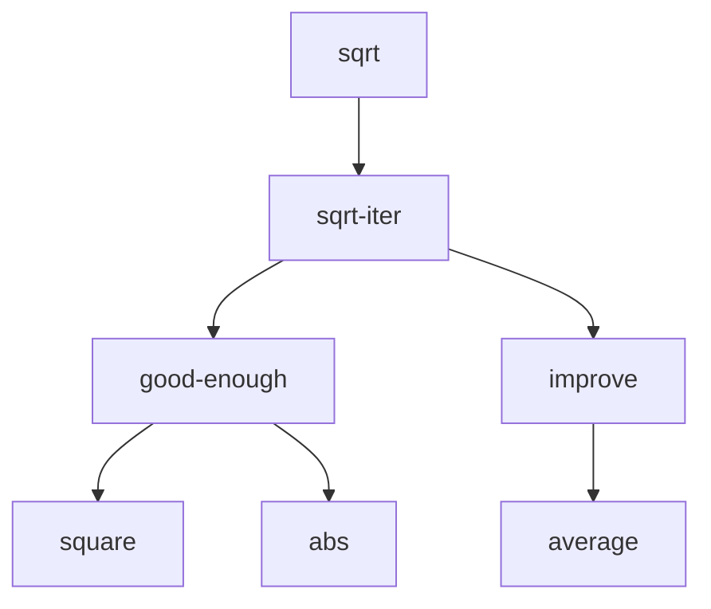

# 1.1.8 Procedures as Black-Box Abstractions

`Sqrt` is our first example of a process defined by a set of
mutually defined procedures. Notice that the definition of
`sqrt-iter` is *recursive*; that is, the procedure is defined
in terms of itself. The idea of being able to define a
procedure in terms of itself may be disturbing; it may seem
unclear how such a "circular" definition could make sense at
all, much less specify a well-defined process to be carried out
by a computer.

The problem of computing square roots breaks up naturally into
a number of subproblems: how to tell whether a guess is good
enough, how to improve a guess, and so on. The entire `qrt`
program can be viewed as a cluster of procedures that mirror
the decomposition of the problem into subproblems.



The importance of this decomposition strategy is not simply
that one is dividing the program into parts. After all, we
could take any large program and divide it into parts.
Rather, it is crucial that each procedure accomplishes an
identifiable task that can be used as a module in defining
other procedures. For example, when we define the
`good-enough?` procedure in terms of `square`, we are able
to regard the `square` procedure as a "black-box". We are not
at that moment concerned with *how* the procedure computes
its result, only with the fact that it computes the square.
The details of how the square is computed can be suppressed,
to be considered at a later time. Indeed, as far as the
`good-enough?` procedure is concerned, `square` is not quite
a procedure but rather an abstraction of a procedure, a
so-called *procedural abstraction*. At this level of abstraction,
any procedure that computes the square is equally good.

So a procedure definition should be able to suppress detail.
The users of the procedure may not have written the procedure
themselves, but may have obtained it from another programmer
as a black box. A user should not need to know how the
procedure is implemented in order to use it.

## Local names

One detail of a procedure's implementation that should not
matter to the user of the procedure is the implementer's
choice of names for the procedure's formal parameters. Thus,
the following procedures should not be distinguishable:

```scheme
(define (square x) (* x x))

(define (square y) (* y y))
```

This principle -- that the meaning of a procedure should be
independent of the parameter names used by its author --
seems on the surface to be self-evident, but its
consequences are profound. The simplest consequence is that
the parameter names of a procedure must be local to the body
of the procedure.

A formal parameter of a procedure has a very special role in
the procedure definition, in that it doesn't matter what
name the formal parameter has. Such a name is called a
*bound variable*, and we say that the procedure definition
*binds* its formal parameter. The meaning of procedure
definition is unchanged if a bound variable is consistently
renamed throughout the definition. If a variable is not
bound, we say that it is *free*. The set of expressions for
which a binding defines a name is called the *scope* of that
name. In a procedure definition, the bound variables declared
as the formal parameter of the procedure have the body of the
procedure as their scope.

The meaning of a procedure is not independent of the names
of its free variables, however. It surely depends upon the
fact (external to this definition) that the symbol `abs`, for
example, names a procedure for computing the absolute value
of a number.

## Internal definitions and block structure

We have one kind of name isolation available to us so far:
The formal parameter of a procedure. There is another way in
which we would like to control the use of names: we would
like to localize the subprocedures, hiding them inside
another procedure so that it could coexist with other
procedures that also define their own similar subprocedures.
To make this possible, we allow a procedure to have internal
definitions that are local to that procedure. For example, in
the square-root problem we can write

```scheme
(define (sqrt x)
    (define (good-enough? guess x)
        (< (abs (- (square guess) x)) 0.001))
    (define (improve guess x)
        (average guess (/ x guess)))
    (define (sqrt-iter guess x)
        (if (good-enough? guess x)
            guess
            (sqrt-iter (improve guess x) x)))
    (sqrt-iter 1.0 x))
```

Such nesting of definitions, called *block structure*, is
basically the right solution to the simplest name-packaging
problem. But there is a better idea lurking here. In addition
to internalizing the definitions of the auxiliary procedures,
we can simplify them. Since `x` is bound in the definition of
`sqrt`, the procedures `good-enough?`, `improve`, and
`sqrt-iter`, which are defined internally to `sqrt`, are in
the scope of `x`. Thus, it is not necessary to pass `x`
explicitly to each of these procedures. Instead, we allow `x`
to be a free variable in the internal definitions, as shown
below. Then `x` gets its value from the argument with which
the enclosing procedure `sqrt` is called. This discipline is called *lexical scoping*.

```scheme
(define (sqrt x)
    (define (good-enough? guess)
        (< (abs (- (square guess) x)) 0.001))
    (define (improve guess)
        (average guess (/ x guess)))
    (define (sqrt-iter guess)
        (if (good-enough? guess x)
            guess
            (sqrt-iter (improve guess x) x)))
    (sqrt-iter 1.0 x))
```

The idea of block structure originated with the programming
language Algol 60. It appears in most advanced programming
languages and is an important tool for helping to organize
the construction of large programs.
