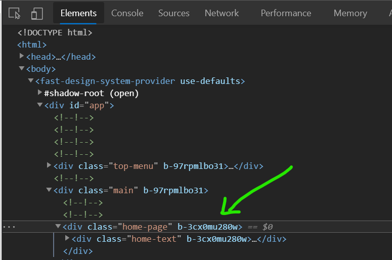
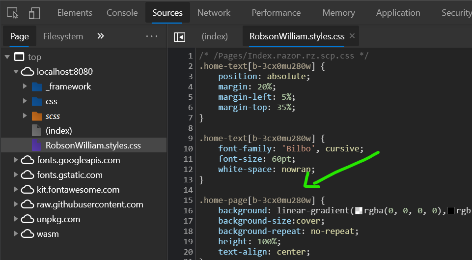

# Building my Person Website

This document lists the steps and details about building my person website.

## Framework

Blazor Web Assembly was choses as the framework for my personal website.

## Styling

To style this web app, [FAST](https://www.fast.design/docs/integrations/blazor) was selected.

## Build and Deployment

* Docker
* Nginx
* GCP
* Cloud Run
* Artifact Registy

This web app is server by Nginx running in a Docker container in GCP's Cloud Run service.

### Building the Docker Image

```bash
$ docker build -t robwillup/rob .
```

### Pushing the image to Docker Hub

```bash
$ docker push robwillup/rob
```

### Tagging the Image to push it to Artifact Registry

Cloud Run cannot deploy images from external repositories (there is a way but is requires some extra configuration). That is why I had to push the image to Artifact Registry.

```bash
$ docker tag robwillup/rob:latest us-west2-docker.pkg.dev/singular-glow-313017/robwillup/rob
```

### Pushing the image to Artifact Registry

```bash
$ docker push us-west2-docker.pkg.dev/singular-glow-313017/robwillup/rob
```

### Deploying to Cloud Run

```bash
gcloud run deploy rob --image us-west2-docker.pkg.dev/singular-glow-313017/robwillup/rob:latest
```

## Custom Domains

[Reference](https://cloud.google.com/load-balancing/docs/ssl-certificates/google-managed-certs)

### Reserving an External IP Address

```bash
gcloud compute addresses create rob-ip --ip-version=IPV4 --global
```

### Getting the IP address

```bash
gcloud compute addresses describe rob-ip --format="get(address)" --global
```

### Creating a Google-managed Certificate

```bash
gcloud compute ssl-certificates create rob --description="Certificate for Rob's personal Website" --domains=robwillup.com --global
```

## External HTTPS Load Balancer

1. Create a serverless NEG for your serverless app. To create a serverless NEG with a Cloud Run (fully managed) service:

```bash
$ gcloud compute network-endpoint-groups create sl-neg-rob \
> --region=us-west2 \
> --network-endpoint-type=serverless \
> --cloud-run-service=rob
Created [https://www.googleapis.com/compute/v1/projects/singular-glow-313017/regions/us-west2/networkEndpointGroups/sl-neg-rob].
Created network endpoint group [sl-neg-rob].
```

2. Create a backend service:

```bash
$ gcloud compute backend-services create be-rob --global
Created [https://www.googleapis.com/compute/v1/projects/singular-glow-313017/global/backendServices/be-rob].
NAME    BACKENDS  PROTOCOL
be-rob            HTTP
```

3. Add the serverless NEG as a backend to the backend service:

```bash
$ gcloud compute backend-services add-backend be-rob \
>     --global \
>     --network-endpoint-group=sl-neg-rob \
>     --network-endpoint-group-region=us-west2
Updated [https://www.googleapis.com/compute/v1/projects/singular-glow-313017/global/backendServices/be-rob].
```

4. Create a URL map to route incoming requests to the backend service:

```bash
$ gcloud compute url-maps create url-map-rob \
>     --default-service be-rob
Created [https://www.googleapis.com/compute/v1/projects/singular-glow-313017/global/urlMaps/url-map-rob].
NAME         DEFAULT_SERVICE
url-map-rob  backendServices/be-rob
```

5. Create a target HTTP(S) proxy to route requests to your URL map:

```bash
$ gcloud compute target-https-proxies create target-https-px-rob \
>     --ssl-certificates=rob \
>     --url-map=url-map-rob
Created [https://www.googleapis.com/compute/v1/projects/singular-glow-313017/global/targetHttpsProxies/target-https-px-rob].
NAME                 SSL_CERTIFICATES  URL_MAP
target-https-px-rob  rob               url-map-rob
```

6. Create a global forwarding rule to route incoming requests to the proxy.:

```bash
$ gcloud compute forwarding-rules create https-fwd-rule-rob \
>     --address=rob-ip \
>     --target-https-proxy=target-https-px-rob \
>     --global \
>     --ports=443
Created [https://www.googleapis.com/compute/v1/projects/singular-glow-313017/global/forwardingRules/https-fwd-rule-rob].
```


## Issues

### CSS Isolation in Docker

#### The Problem

When using Docker and Nginx to server the Blazor WASM app, some CSS would not work. So the styling would be messed up, there were some missing fonts and images.

After some debugging I realized the issue was related to the [`scope identifiers`](https://docs.microsoft.com/en-us/aspnet/core/blazor/components/css-isolation?view=aspnetcore-5.0#css-isolation-bundling).

The identifiers in the bundled CSS file, `{ASSEMBLY NAME}.styles.css`, did not match the ones in the actual razor files.

In the two images below, the `scope` identifiers are matching, and that's what I have when running the app locally with the `dotnet` CLI and also after the problem was resolved with the Docker image:





#### The cause

The problem "seems" to be a bug in the `dotnet publish` command, which was not regenerating the scope identifiers for new publishes.

I've added a comment to this [Stack Overflow answer](https://stackoverflow.com/a/65548488/7007769).

#### The Solution

Deleting and recreating the isolated CSS files with the same content actually did the trick. Please, refer to the link above.
