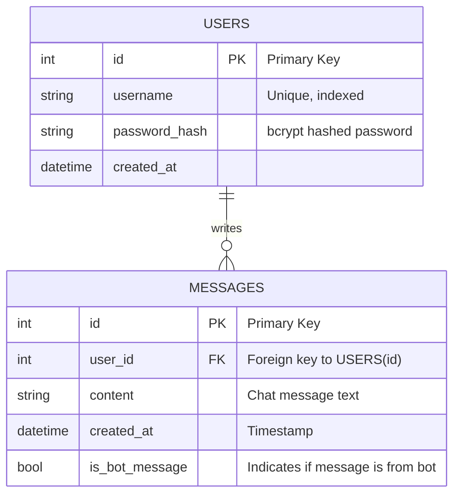

# DB Diagram Schema

```mermaid
erDiagram
    USERS {
        int id PK "Primary Key"
        string username "Unique, indexed"
        string password_hash "bcrypt hashed password"
        datetime created_at
    }
    MESSAGES {
        int id PK "Primary Key"
        int user_id FK "Foreign key to USERS(id)"
        string content "Chat message text"
        datetime created_at "Timestamp"
        bool is_bot_message "Indicates if message is from bot"
    }
    
    USERS ||--o{ MESSAGES : "writes"

```
