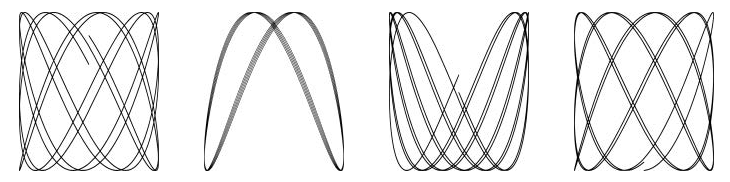

# 1.4 Animated GIFs

The next program demonstrates basic usage of Go's standard image packages, which we'll use to create a sequence of bit-mapped images and then encode the sequence as a GIF animation. The images, called *Lissajous figures*, were a staple visual effect in sci-fi films of the 1960s. They are the parametric curves produces by harmonic oscillation in two dimensions, such as two sine waves fed into the *x* and *y* inputs of an oscilloscope. This is an example:



There are several new constructs in this code, including `const` declarations, struct types,and composite literals. This example also involves floating-point computations.

```go
// Lissajous generates GIF animations of random Lissajous figures
package main

import (
 "image"
 "image/color"
 "image/gif"
 "io"
 "math"
 "math/rand"
 "os"
)

var palette = []color.Color{color.White, color.Black}
const (
 whiteIndex = 0 // first color in palette
 blackIndex = 1 // next color in palette
)

func main() {
 lissajous(os.Stdout)
}

func lissajous(out io.Writer) {
    const(
       cycles  = 5     // number of complete x oscillator revolutions
       res     = 0.001 // angular resolution
       size    = 100   // image canvas covers [-size..+size]
       nframes = 64    // number of animation frames
       delay   = 8     // delay between frames in 10ms units
    )
    freq := rand.Float64() * 3.0 // relative frequency of y oscillator
    anim := gif.GIF{LoopCount: nframes}
    phase := 0.0 // phase difference
    for i := 0; i < nframes; i++ {
        rect := image.Rect(0, 0, 2*size+1, 2*size+1)
        img := image.NewPaletted(rect, palette)
        for t := 0.0; t < cycles*2*math.Pi; t += res {
            x := math.Sin(t)
            y := math.Sin(t*freq + phase)
            img.SetColorIndex(size+int(x*size+0.5), size+int(y*size+0.5), blackIndex)
        }
        phase += 0.1
        anim.Delay = append(anim.Delay, delay)
        anim.Image = append(anim.Image, img)
    }
    gif.EncodeAll(out, &anim) // NOTE: ignoring encoding errors
}
```

After importing a package whose path has multiple components, like `image/color`, we refer to the package with a name that comes from the last component. Thus the variable `color.White` belongs to the `image/color` package.

A `cost` declaration gives names to constants, that is, values that are fixed at compile time.

Like `var` declarations, `cost` declarations may appear at package level (so the names are visible throughout the package) or within a function (so the names are visible only withing that function). The value of a constant, but be a number, string, or boolean.

The expressions `[]color.Color{...}` and `gif.GIF{...}` are *composite literals*, a compact notation for instantiating any of Go's composite types from a sequence of element values. Here, the first one is a slice and the second one is a struct.

The type `gif.GIF` is a struct type. A struct is a group of values called fields, often of different types, that are collected together in a single object that can be treated as a unit. 
