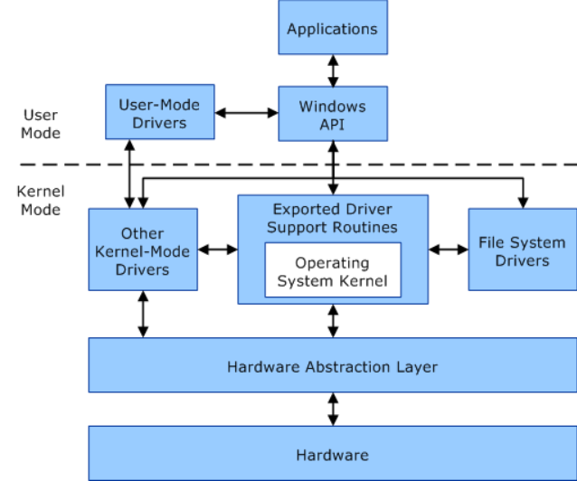

# User Mode and Kernel Mode

A processor in a computer running Windows has two different modes:
A user mode and a kernel mode.

The processor switches between the two modes depending on what type of code
is running on the processor. Applications run in user mode, and core
operating system components run in kernel mode. Many drivers run in kernel
mode, but some may run in user mode.

## User mode

When you start a user-mode application, Windows creates a *process* for the
application. The process provides the application with a private *virtual
address space* and a private *handle table*. Because an application's virtual
address space is private, one application cannot alter data that belongs to
another application. Each application runs in isolation, and if an
application crashes, the crash is limited to that one application. Other
applications and the operating system are not affected by the crash.

In addition to being private, the virtual address space of a user-mode
application is limited. A processor running in user mode cannot access
virtual addresses that are reserved for the operating system. Limiting the
virtual address space of a user-mode application prevents the application
from altering, and possibly damaging, critical operating system data.

## Kernel mode

All code that runs in kernel mode shares a single virtual address space. This
means that a kernel-mode driver is not isolated from other drivers and the
operating system itself. If a kernel-mode driver accidentally writes to the
wrong virtual address, data that belongs to the operating system or another
driver could be compromised. If a kernel-mode driver crashes, the entire
operating system crashes.

